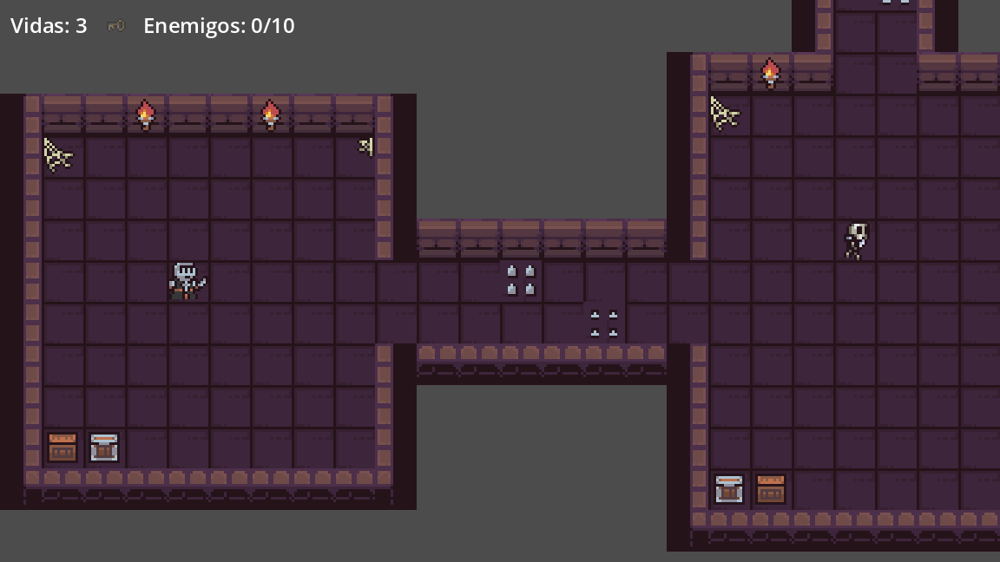

# Dungeon Escape

Juego de acción 2D con vista cenital, hecho en **Godot 4.7.2**. El jugador controla a un caballero que debe recorrer un calabozo de 7 salas, conseguir la llave que custodia una parca y llegar a la puerta de salida.



## Cómo jugar

| Acción | Teclas |
|---|---|
| Moverse (8 direcciones) | Flechas o W A S D |
| Atacar con la espada | Espacio o J |
| Reiniciar (en las pantallas finales) | R |

**Objetivo:** encontrar la llave y llegar a la puerta de salida, en el extremo opuesto del mapa.

- El jugador tiene **3 vidas** y medio segundo de invulnerabilidad después de recibir daño.
- Las **trampas de picos** hacen daño solo cuando los picos están levantados.
- Enemigos:

| Enemigo | Vida | Comportamiento |
|---|---|---|
| Esqueleto | 2 golpes | Patrulla entre dos puntos |
| Vampiro | 3 golpes | Persigue al jugador a menos de 80 px y vuelve a su puesto si lo pierde |
| Parca (jefe) | 5 golpes | Lenta; protege la sala de la llave |

- La interfaz muestra las vidas, si se tiene la llave y cuántos enemigos se eliminaron. La pantalla de victoria incluye ese contador.

## Cómo ejecutarlo

### Opción 1: ejecutable (sin instalar Godot)

- **Windows:** `windows/dungeon-escape.exe`
- **Linux:** `linux/dungeon-escape.x86_64` (si no arranca, darle permiso de ejecución con `chmod +x dungeon-escape.x86_64`)

### Opción 2: abrir el proyecto en Godot

1. Instalar **Godot 4.7.2** (versión estándar, no .NET).
2. En el gestor de proyectos: **Importar** → seleccionar el archivo `project.godot`.
3. Presionar **F5** (o el botón ▶) para jugar. La escena principal es `scenes/Level.tscn`.

## Estructura del proyecto

```text
scenes/          Escenas: nivel, jugador, enemigos, trampas, llave, puerta, HUD
  props/         Decoración animada (antorchas, estandartes, candelabros)
scripts/         Lógica en GDScript, comentada en español
  enemy_base.gd  Clase base de enemigos (vida, daño, golpe recibido, muerte)
  chaser_enemy.gd  Persecución con regreso a su puesto (vampiro y parca)
  level.gd       Conecta jugador, puerta, enemigos e interfaz
tilesets/        TileSet del calabozo con colisión en las paredes
assets/          Sprites del calabozo y de los enemigos
addons/godot_ai/ Plugin usado durante el desarrollo (ver nota)
```

Decisiones de diseño principales:

- **Enemigos reutilizables:** `EnemyBase` concentra vida, daño por contacto, reacción al golpe (animación, parpadeo rojo y retroceso) y muerte. Cada enemigo solo define cómo se mueve.
- **Colisiones por capas:** `world`, `player` y `enemies`. Los enemigos chocan con las paredes pero no bloquean al jugador.
- **Interfaz desacoplada:** el HUD solo muestra datos; `level.gd` decide cuándo actualizarlo.

## Nota sobre el plugin godot-ai

El proyecto se desarrolló con asistencia de IA mediante el plugin [godot-ai](https://github.com/hi-godot/godot-ai) (v4.1.0), que conecta el editor de Godot con un asistente por MCP. **No hace falta para jugar.** Si al abrir el proyecto el editor muestra avisos del plugin, se puede desactivar en **Proyecto → Configuración del proyecto → Plugins**.

## Créditos de los assets

Los sprites incluidos en `assets/` provienen de packs de pixel art de terceros (el calabozo, los objetos y los enemigos). Su uso en este proyecto es con fines educativos.
